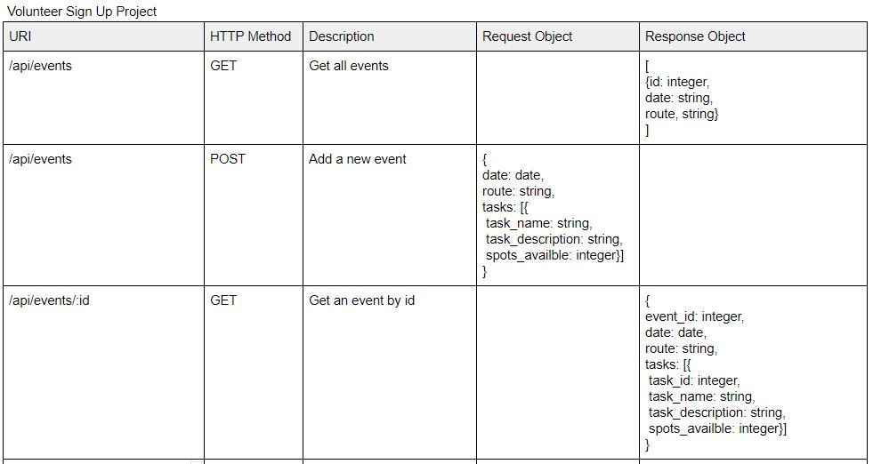
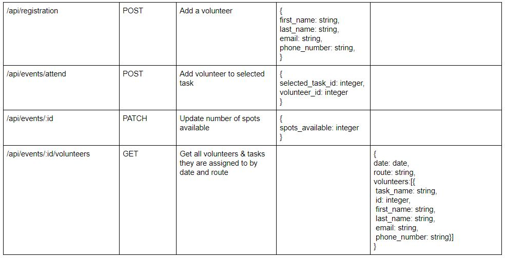

# Esperança Project

Welcome to my first MVP. This was created in a one-week sprint as a bootcamp project for CodeOp.

The project is a volunteer sign up page inspired by "Esperança", a community of volunteers that go out to neighborhoods of Barcelona handing out food and talking to people living on the streets.

Check out the deployed app on Heroku: [Esperança Project](https://volunteer-sign-up-project.herokuapp.com/)


## Technologies

The main technologies used to develop this project were:

Front-end: React.js, JavaScript ES6, HTML, CSS, Bootstrap & Reactstrap.

Back-end: Node.js, Express.js & MySQL.

Deployment: Heroku.

- [EmailJS](https://www.emailjs.com/): Used to send emails directly through the contact form on the about page.

## Documentation

## User Flow Diagram


## Database Schema


## API Routes Plan




## Project Architecture


## Setup

### Dependencies

Run `yarn` on root folder to install dependencies related to Express.

`cd client` and run `yarn` install dependencies related to React.

### Database Prep

- Access the MySQL interface in your terminal by running `mysql -u root -p`
- Add a `.env` file to the main folder of this repository containing the MySQL authentication information for MySQL user. For example:

```bash
  DB_HOST=localhost
  DB_USER=root
  DB_NAME=sign_up_project
  DB_PASS=
```

- Run `yarn migrate` in the main folder of this repository. This will create the database and the 5 tables you need for this project in your database (events, tasks, volunteers, event_tasks, tasks_volunteers).

### Add env variables

On the root folder for accessing the api port:

```bash
  PORT=5000
```

On the client folder, to access your personal EmailJS user id:

```bash
  REACT_APP_USER_ID=
```

In order to create a user id for EmailJS, you will have to sign up for the service through their website: <a href="https://www.emailjs.com/">EmailJS</a>

### Run Your Development Servers

- Run `yarn dev` in the project directory to start the servers.
- You can test your client app in `http://localhost:3000`
- You can test your API in `http://localhost:5000/api`

## Notes

_This is a student project that was created at [CodeOp](http://codeop.tech), a full stack development bootcamp in Barcelona._
